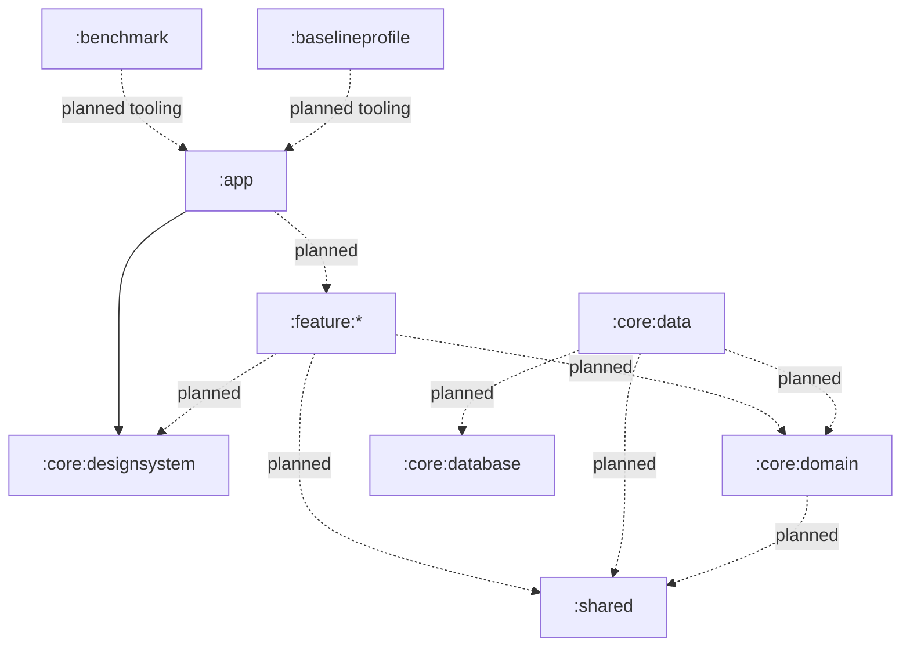

# Pocket Ledger Architecture

This document explains the current Android/Kotlin Multiplatform project structure, the intended module ownership boundaries, and the dependency rules reviewers should enforce during PR review.

The goal is practical modularity. Code should have one clear owner, dependencies should point in a predictable direction, and planned modules should not be treated as implemented until they are added to `androidApp/settings.gradle.kts`.

## Current Project Layout

The Android project lives under `androidApp/`.

Current implemented Gradle modules:

```text
:app
:core:designsystem
:shared
```

The project also includes `androidApp/build-logic` as an included build. It contains Gradle convention plugins for Android application modules, Android library modules, Compose setup, and Kotlin Multiplatform setup. It is build infrastructure, not an application runtime module.

## Current Module Graph

The current implemented project dependency graph is:

```text
:app
  -> :core:designsystem

:core:designsystem
  -> external AndroidX Compose UI dependencies

:shared
  -> external Kotlin test dependency for common tests
```

There are no implemented `:feature:*`, `:core:data`, `:core:domain`, `:core:database`, benchmark, or baseline profile modules at the time this document was written.

## Planned Module Types

These module types are planned architecture targets. They should only be documented as implemented after they appear in `androidApp/settings.gradle.kts`.

```text
:feature:*
:core:domain
:core:data
:core:database
:benchmark
:baselineprofile
```

Exact names may change as the project grows, but the ownership and dependency rules below should remain the default.

## Ownership Boundaries

### `:app`

`:app` is the Android application shell. It owns:

- application ID, manifest, launcher activity, signing, and build variant configuration
- app bootstrap
- top-level Compose host
- top-level navigation wiring when feature modules exist
- application-bound dependency wiring

Keep `:app` thin. It should not contain business logic, data access, repository implementations, database entities, DTO mapping, or feature-specific workflow logic. Temporary bootstrap UI is acceptable early in the project, but it should move into feature modules when those modules are introduced.

### `:core:designsystem`

`:core:designsystem` owns reusable UI foundations:

- Material theme setup
- color, typography, shape, spacing, and similar design tokens
- low-level reusable Compose components used across multiple screens
- preview theme helpers

It should not contain feature-specific screens, ViewModels, navigation flows, repositories, use cases, database code, network code, or product workflow logic.

### `:shared`

`:shared` is the selectively KMP-based module. It should contain platform-independent domain and business logic only:

- pure Kotlin value objects
- reusable validation or calculation logic
- platform-independent business rules
- common tests for that logic

Prefer `commonMain` for shared logic. Use platform-specific source sets only when the behavior genuinely requires a platform API. `:shared` should not contain Android Compose UI, Android framework types, Android persistence implementations, or Android-only network/data infrastructure.

### Future `:feature:*`

Feature modules will own user-facing product workflows:

- Compose screens and screen-level UI state
- ViewModels
- feature navigation entry points
- feature-specific UI models
- feature-specific presentation logic

Feature modules may depend on stable core APIs and shared logic. They must not depend on `:app`, other feature modules by default, database implementation modules, or network implementation details.

### Future Core Modules

Future core modules should be split by responsibility:

- `:core:domain`: Android-app domain models, use cases, and repository contracts.
- `:core:data`: repository implementations, data orchestration, and mapping between data models and domain models.
- `:core:database`: local persistence configuration, DAOs/queries, entities, and migrations.

Domain code should stay free of Android framework APIs, Compose, database implementations, and network DTOs. Data and database modules should not expose persistence entities or DTOs directly to UI modules.

### Future Benchmark Module

A future benchmark module should own performance benchmarks and benchmark-only test harness code. It may depend on the app or target modules as required by Android benchmark tooling, but production modules must not depend on benchmark modules.

Benchmark code should not introduce runtime behavior into production modules.

### Future Baseline Profile Module

A future baseline profile module should own baseline profile generation and profile collection setup. It may depend on the app as required by Android baseline profile tooling.

Production modules must not depend on the baseline profile module. Baseline profile code should not own product behavior or feature logic.

## Dependency Direction

Dependencies should point from outer, product-specific modules toward stable, reusable modules:



Solid arrows are implemented now. Dotted arrows are planned dependency directions for future modules.

## Allowed Dependencies

Current allowed project dependency:

```kotlin
// :app
implementation(project(":core:designsystem"))
```

Allowed future examples:

```kotlin
// :app can depend on feature modules when they exist.
implementation(project(":feature:transactions"))

// Feature modules can depend on stable UI, domain, and shared APIs.
implementation(project(":core:designsystem"))
implementation(project(":core:domain"))
implementation(project(":shared"))

// Data can implement domain contracts and use persistence infrastructure.
implementation(project(":core:domain"))
implementation(project(":core:database"))
implementation(project(":shared"))

// Domain can use platform-independent shared business logic.
implementation(project(":shared"))
```

Benchmark and baseline profile modules are special tooling modules. They may depend on `:app` when required by Android tooling, but this exception must not be copied into production modules.

## Forbidden Dependencies

Do not add dependencies that invert ownership:

```kotlin
// Features must not depend on the application shell.
implementation(project(":app"))

// Core UI foundations must not depend on product workflows.
implementation(project(":feature:transactions"))

// Domain must not depend on data implementation details.
implementation(project(":core:data"))

// Database must not depend on UI.
implementation(project(":core:designsystem"))

// Shared KMP common code must not depend on Android app modules.
implementation(project(":app"))
implementation(project(":core:designsystem"))

// Production modules must not depend on benchmark or baseline profile modules.
implementation(project(":benchmark"))
implementation(project(":baselineprofile"))
```

Also avoid feature-to-feature dependencies unless an explicit architecture decision allows it. If two features need the same behavior, move the stable contract or reusable logic into an appropriate core or shared module.

## Architectural Rationale

### Android-first

Pocket Ledger is currently an Android app. The project should optimize for Android correctness, Android build reliability, Compose UI, and Android release hardening first. KMP should support reuse where it is valuable, not force every layer into a cross-platform abstraction prematurely.

### Offline-first

The product should be designed so core user workflows can work from local state. Future data modules should treat local persistence as the primary source of truth where appropriate, then synchronize with remote sources if remote features are introduced. UI and domain code should not depend directly on network availability.

### Modular

Modularity keeps the application shell small, makes ownership clear, and lets PR reviewers catch boundary violations early. It also keeps future feature work from turning `:app` into a mixed UI, data, and domain module.

### Selectively KMP-based

`:shared` exists for platform-independent business logic that is worth reusing and testing outside Android-specific code. Android-only UI, persistence, and framework integration should stay in Android modules. This keeps KMP useful without making the architecture more complex than the current product needs.

## Placement Rules

Use these defaults when adding code:

- App bootstrap, manifest, app ID, signing, and top-level host: `:app`
- Product-wide Compose theme and reusable UI primitives: `:core:designsystem`
- Platform-independent business rules and value objects: `:shared`
- Screen UI, ViewModels, UI state, and feature routes: future `:feature:*`
- Use cases and repository contracts: future `:core:domain`
- Repository implementations, DTO mapping, and data orchestration: future `:core:data`
- Entities, DAOs/queries, migrations, and database setup: future `:core:database`
- Macrobenchmarks and benchmark harnesses: future benchmark module
- Baseline profile generation setup: future baseline profile module

A Compose screen should not parse DTOs. A repository implementation should not import Compose. A domain use case should not depend on Android framework APIs. A design system component should not know about a specific product workflow.

## Public API Rules

Every module should expose the smallest useful API:

- Prefer `internal` for implementation details.
- Treat public classes and functions as module contracts.
- Do not expose database entities or network DTOs through UI or domain APIs.
- Do not expose third-party implementation types unless they are intentionally part of the contract.
- Keep preview-only helpers out of production APIs where practical.

If a module needs behavior from another layer, depend on a stable contract in a core or shared module instead of reaching into implementation classes.

## PR Review Checklist

Before approving a module or dependency change, check:

1. Is the module listed in `androidApp/settings.gradle.kts` if the documentation says it exists?
2. Does the dependency point in the allowed direction?
3. Is `:app` still thin?
4. Is `:shared` free of Android-specific app and UI dependencies?
5. Is `:core:designsystem` free of feature-specific workflow logic?
6. Are planned modules described as planned, not implemented?
7. Are DTOs and database entities kept out of UI/domain public APIs?

## Generated and Local Files

Do not commit generated or local build outputs:

- `.gradle/`
- `build/`
- `.kotlin/`
- `local.properties`
- IDE workspace files

Generated files may exist locally after Gradle or Android Studio runs, but they must remain ignored and untracked.
