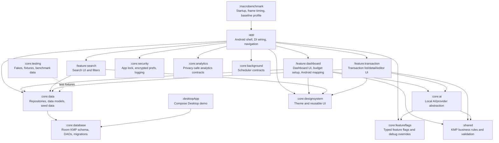
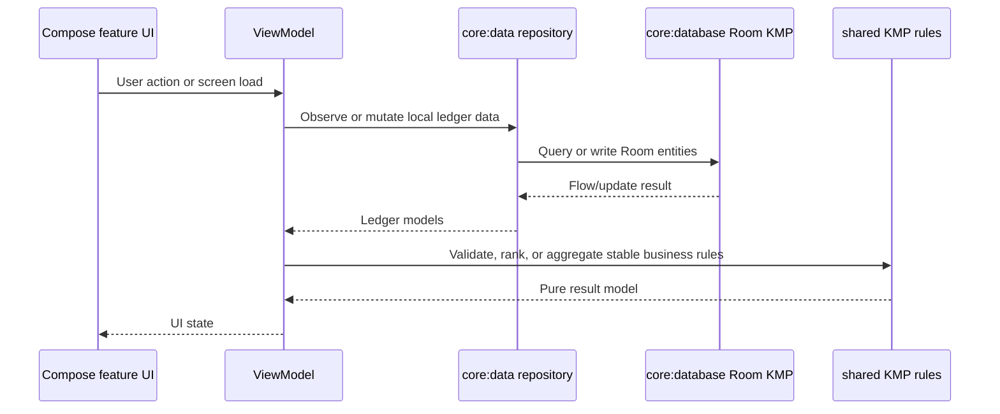
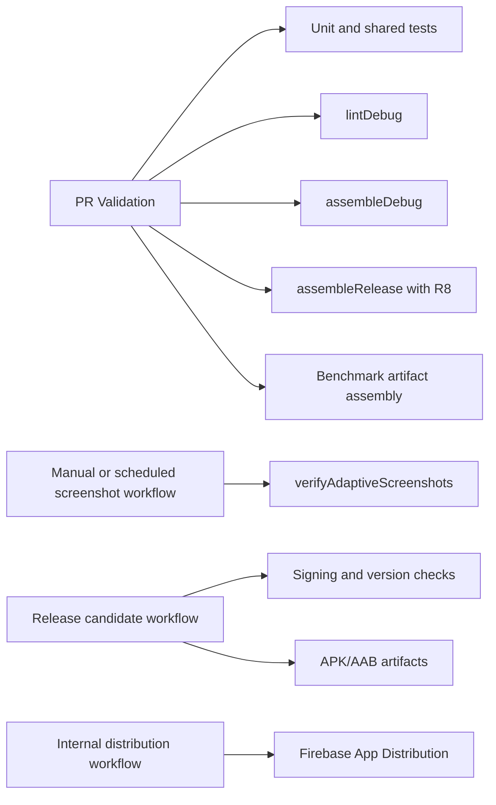

# Portfolio Architecture Diagram

This document gives reviewers a quick architecture view. The detailed architecture rules live in `docs/architecture.md` and `androidApp/docs/architecture.md`.

## Module Graph

## Runtime Data Flow

## Release Validation Flow

## Key Decisions For Reviewers

- The app shell is intentionally thin; feature behavior belongs in feature modules or reusable core/shared modules.
- Room schema, DAOs, migrations, and versioning are shared through `:core:database` common source.
- Stable business rules that do not need Android APIs live in `:shared`.
- Android repositories and Compose UI stay Android-scoped to avoid premature cross-platform abstraction.
- Debug/release/benchmark behavior is separated so demo tooling and test helpers do not leak into release builds.

## ADR Index

- `docs/adr/0001-modular-architecture.md`: modular architecture and KMP-ready structure.
- `docs/adr/0002-local-first-room-kmp.md`: local-first persistence and Room KMP boundary.
- `docs/adr/0003-portfolio-release-quality.md`: portfolio-quality documentation, validation, and release evidence strategy.